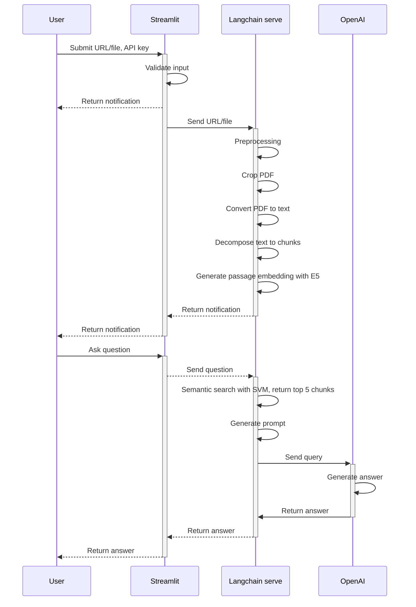

# pdfGPT-chat
### _Chat with your PDF!_
**pdfGPT-chat** is a fork of [pdfGPT] with several improvements.
Powered by [Microsoft E5 Multilingual Text Embeddings] and OpenAI 

[pdfGPT]:https://github.com/bhaskatripathi/pdfGPT/
[Microsoft E5 Multilingual Text Embeddings]:https://github.com/microsoft/unilm/tree/master/e5

## Demo
Try it now on streamlit share! https://pdfgptchat.streamlit.app

## Background
pdfGPT is an awesome app for chatting with  your PDF, however several things can be improved:
1. The developers cited Andrej Karpathy tweet that KNN algorithm is superb for lookups on embedding, however Andrej Karpathy also mentioned that SVM (Support Vector Machine) yield better results than KNN.
2. For sentence embedding, pdfGPT use Universal Sentence Encoder (USE) which was released 2018. Several newer models, even fine-tuned for question answering (QA) and has multilingual support, are available.
3. pdfGPT use text-davinci-003 to generate answer, gpt-3.5-turbo gives similar performance at [a fraction of the cost].
4. Some pdf have header, footer, or some text in vertical margin. Some also implement word break with hyphen. This can polute sentence embedding.

[a fraction of the cost]:https://openai.com/pricing
[Andrej Karpathy tweet]:https://twitter.com/karpathy/status/1647025230546886658

## ✨Improvements
1. **SVM** is implemented for semantic searching instead of KNN.
2. **E5 Multilingual** Text Embedding, a newer sentence embedding model fine-tuned for QA, is utilized for embedding. [Support 100 languages] and has [better performance] compared to USE.
3. **GPT-3.5-turbo** is used for generating answer (**10x cheaper**). GPT-4 option is also available.
4. Crop pdf to eliminate margin and polluting text.
5. **Chat history** in a session is **downloadable** as csv.
6. **Chat-sytle** UI made with streamlit, instead of grado.

[Support 100 languages]:https://huggingface.co/intfloat/multilingual-e5-base
[better performance]:https://arxiv.org/pdf/2212.03533.pdf

## Use pdfGPT on production using [langchain-serve]
**Local playground**
1. To expose the app as an API using langchain-serve, open one terminal and run:
```sh
lc-serve deploy local api.py
```sh
2. To start streamlit, open another terminal and run:
```sh
streamlit run app.py
```
3. To interact with the UI, access from browser:
```sh
http://localhost:8501/
```

**Cloud deployment**
Deploy pdfGPT-chat on [Jina Cloud] by running:
```sh
lc-serve deploy jcloud api.py
```
[Jina Cloud]:https://cloud.jina.ai/

## UML
